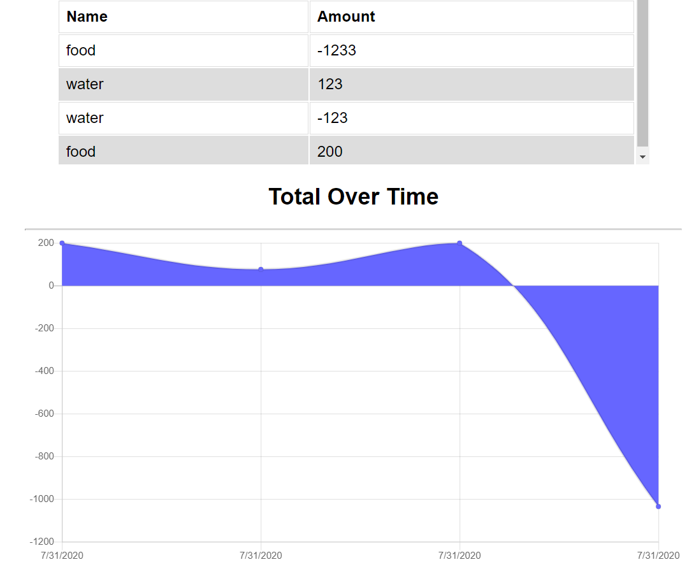

# [Budget-Tracker](https://github.com/Adambear1/Progressive_Budget)

## Description

Budget Tracker is a progressive web application that allows the user to track their finances, with or without internet connection. My task with this project was to add functionality to a pre-built application to allow for offline access and functionality. I added some minor stylistic changes, but the front-end logic remained the same. This application achieves offline functionality by utilizing Service Workers and the Cache API to store static files and API responses in the users local cache. When the user is offline they have access to this data and these cached files. While offline, they may add an expense or deposit, which is stored in their local IndexedDB database. When internet connection is detected, those transactions are posted from their IndexedDB database to their MongoDB database. Their total budget is then updated, and their IndexedDB pending object store is cleared.

## Table of Contents

- [Technologies](#technologies)
- [Usage](#usage)
- [Finished Product](#finished-product)
- [Directions for Future Development](#Directions-for-future-Development)

## Technologies

- [HTML](https://html.com/)
- [CSS](https://developer.mozilla.org/en-US/docs/Web/CSS)
- [JavaScript](https://www.javascript.com/)
- [Node.js](https://nodejs.org/en/)
- [Express.js](https://expressjs.com/)
- [MongoDB](https://www.mongodb.com/)
- [Mongo Atlas](https://www.mongodb.com/cloud/atlas)
- [Mongoose](https://www.npmjs.com/package/mongoose)
- [IndexedDB](https://developer.mozilla.org/en-US/docs/Web/API/IndexedDB_API)
- [Service Workers](https://developers.google.com/web/fundamentals/primers/service-workers)
- [Cache API](https://developer.mozilla.org/en-US/docs/Web/API/Cache)
- [Heroku](https://dashboard.heroku.com/apps)

## Usage

- Navigate to the [deployed Heroku App](https://adam-budget-tracker.herokuapp.com/).
- Enter a transaction name and amount, choose whether the transaction is a deposit (add funds) or an expense (subtract funds).
- View a table containing past transactions.
- View a chart that tracks your total budget over time.
- While offline you may continue to view the application and add transactions.
- When internet is detected, your total budget will update based on those transactions.
- To test offline capabilities either:
  - Turn your wifi off or
  - Open your browsers' Dev Tools --> Application --> Service Workers --> Check the "Offline" box.

## Finished Product

View deployed Heroku app [here](https://adam-budget-tracker.herokuapp.com/).  

## Directions for Future Development

While this application does successfully allow for the user to add and view expenses while they're offline, I think it would be useful for them to be able to delete and update expenses as well. In the future I would do so using the same process as described in the [description](#description) above.

When the deployed application is loaded for the first time in awhile, it takes a couple seconds for the transactions and budget data to be accessed from the Mongo database. Since this only happens the first time the app is loaded in awhile, I suspect it's because of Heroku and the way it unloads unused applications and data from server memory. However, the couple seconds it takes feels too slow and in the future I'd like to try and figure out a way to fix this.
